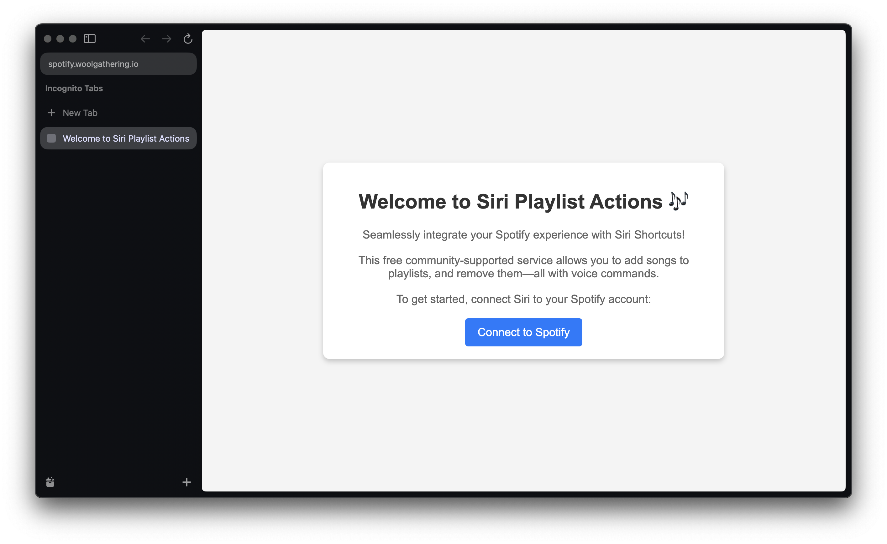
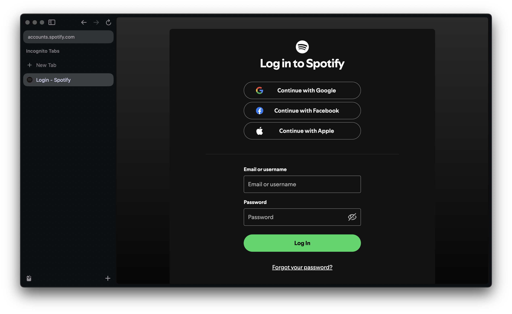
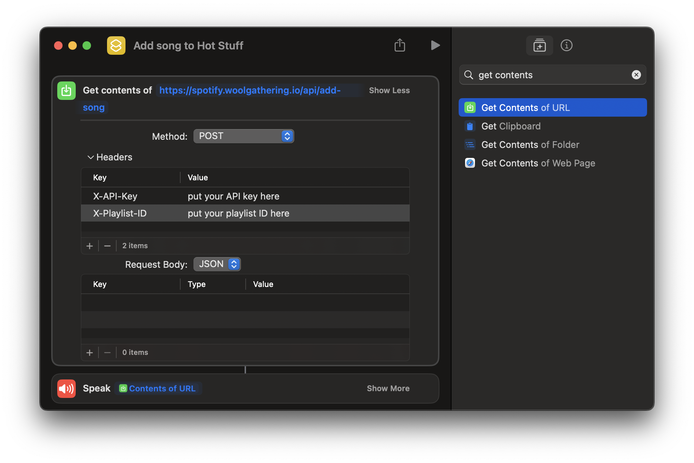

# siri-playlist-actions

Custom siri actions to interact with the current Spotify song or playlist

## Try it out

1. Navigate to https://spotify.woolgathering.io/
2. Connect to Spotify
3. Follow the setup instruction to create an Apple Shortcut
4. Try using a Siri voice command to trigger the shortcut

## Local Development

Create a .env.local file from existing vercel environment variables (optional)

    vercel env pull

The best way to set a variable for dev vs prod is to set it in Vercel, and then specify the particular environment for variable. For example:

| Environment | Key          | Value                                          |
|-------------|--------------|------------------------------------------------|
| Development | REDIRECT_URI | http://localhost:8080/api/callback             |
| Production  | REDIRECT_URI | https://spotify.woolgathering.io/api/callback  |

Run the server:

    vercel dev --listen 8080

Note that `vercel dev` actually pulls the environment variables from vercel, and does not respect your .env.local file (annoying). Thus the `vercel env pull` command above is not necessary, but I find it helpful to actually see the env variables.

Navigate to http://localhost:8080/ and click "Connect to Spotify", which will redirect you to a setup page with instructions.

The best way to test changes is to setup Apple Shortcuts as described on the setup page. However, you can also use `curl`, like so:

Endpoint: `/api/current-song`

    curl -X GET "http://localhost:8080/api/current-song" \
     -H "X-API-Key: YOUR_API_KEY"

Endpoint: `/api/add-song`

    curl -X POST "http://localhost:8080/api/add-song" \
     -H "Content-Type: application/json" \
     -H "X-API-Key: YOUR_API_KEY" \
     -d '{"playlist_id": "YOUR_PLAYLIST_ID"}'

Endpoint: `/api/remove-song`

    curl -X DELETE "http://localhost:8080/api/remove-song" \
     -H "X-API-Key: YOUR_API_KEY"

Endpoint: `/api/revoke`

    curl -X POST http://localhost:8080/api/revoke \
     -H "X-API-Key: YOUR_API_KEY"

## Deploy

To prod:

    vercel deploy --prod

Note that a redeployment is necessary after changing environment variables.
