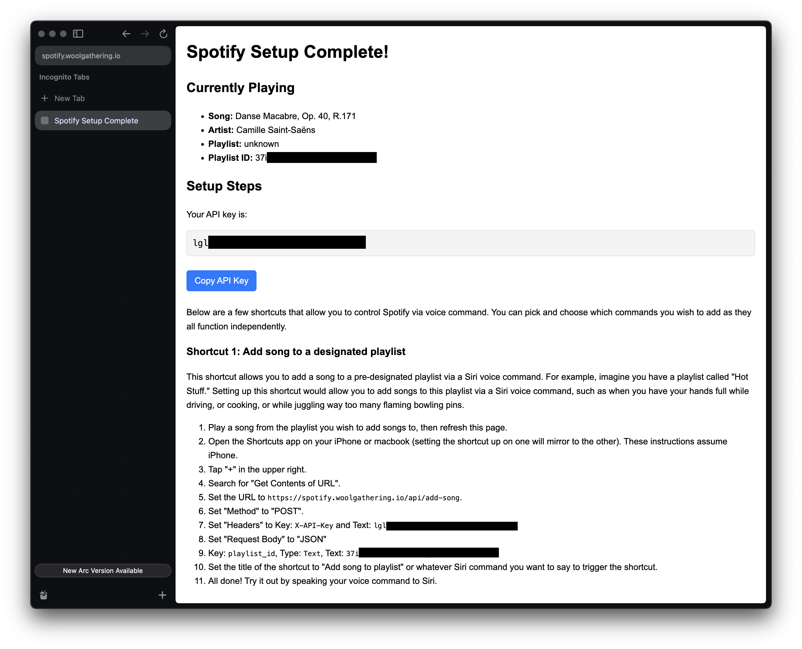

# siri-playlist-actions

Custom siri actions to interact with the current Spotify song or playlist

## Try it out

1. Navigate to https://spotify.woolgathering.io/
2. Connect to Spotify (Note: I'll need to add you as an approved beta tester in order to login, or you can setup your own spotify developer credentials, described below)
3. Follow the setup instruction to create an Apple Shortcut
4. Try using a Siri voice command to trigger the shortcut





## Code structure

All the magic happens in `api/` and `utils/`.

The order of API endpoints triggered in a user flow is:

### Initial setup
1. `api/landing.go` - a simple static HTML landing page
2. `api/login.go` - redirects the user to the spotify auth page
3. `api/callback.go` - receives a callback from spotify that includes a code we can then exchange for an auth token
4. `api/setup.go` - a static html page with instructions on how to setup Apple shortcuts

### Regular usage
These can be used in any order
* `api/current-song.go`
* `api/add-song.go`
* `api/remove-song.go`

### Revoke
* `api/revoke.go`


## Local Development

Create a .env.local file from existing vercel environment variables (optional)

    vercel env pull

The best way to set a variable for dev vs prod is to set it in Vercel, and then specify the particular environment for variable. For example:

| Environment | Key          | Value                                          |
|-------------|--------------|------------------------------------------------|
| Development | REDIRECT_URI | http://localhost:8080/api/callback             |
| Production  | REDIRECT_URI | https://spotify.woolgathering.io/api/callback  |


Run the server:

    vercel dev --listen 8080

Note that `vercel dev` actually pulls the environment variables from vercel, and does not respect your .env.local file (annoying). Thus the `vercel env pull` command above is not necessary, but I find it helpful to actually see the env variables.

Navigate to http://localhost:8080/ and click "Connect to Spotify", which will redirect you to a setup page with instructions.

The best way to test changes is to setup Apple Shortcuts as described on the setup page. However, you can also use `curl`, like so:

Endpoint: `/api/current-song`

    curl -X GET "http://localhost:8080/api/current-song" \
     -H "X-API-Key: YOUR_API_KEY"

Endpoint: `/api/add-song`

    curl -X POST "http://localhost:8080/api/add-song" \
     -H "Content-Type: application/json" \
     -H "X-API-Key: YOUR_API_KEY" \
     -d '{"playlist_id": "YOUR_PLAYLIST_ID"}'

Endpoint: `/api/remove-song`

    curl -X DELETE "http://localhost:8080/api/remove-song" \
     -H "X-API-Key: YOUR_API_KEY"

Endpoint: `/api/revoke`

    curl -X POST http://localhost:8080/api/revoke \
     -H "X-API-Key: YOUR_API_KEY"


## Deploy

Every push to the `main` branch triggers a new prod deploy, however if you want to deploy manually:

    vercel deploy --prod

Note that a redeployment is necessary after changing environment variables.


## Set up your own Spotify developer credentials

1. Follow the Spotify Developer Getting Started guide at https://developer.spotify.com/documentation/web-api to create your own developer credentials
2. Fork this repo
3. Setup a free account with Vercel for serverless deployments
4. Through the Vercel marketplace, setup a free Redis data store with Upstash

## Running Unit Tests

This project uses Go's built-in testing framework. To run all unit tests, use:

```
go test ./...
```

Test files are located alongside the code in the `api/` and `utils/` directories, following the Go convention of using `_test.go` suffix.
